# Query Builder Instructions

Query Builder is implemented with python, html and javascript as a Jupyter notebook. Here, we describe how the tool can be utilized from the AEGIS platform.

## STEP 1(Optional) - Install the notebook

If the Query Builder Jupyter notebook does not already exist in a specific project, you should first [download](https://www.github.com/aegisbigdata/query-builder) it. Then, upload the QueryBuilder_v1.ipynb file into Jupyter from the corresponding menu, as seen in figure below

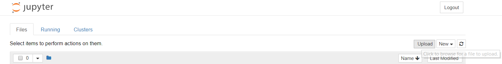

## STEP 2 - Open the notebook

Once the notebook is present, click on it to open. You will see the following:

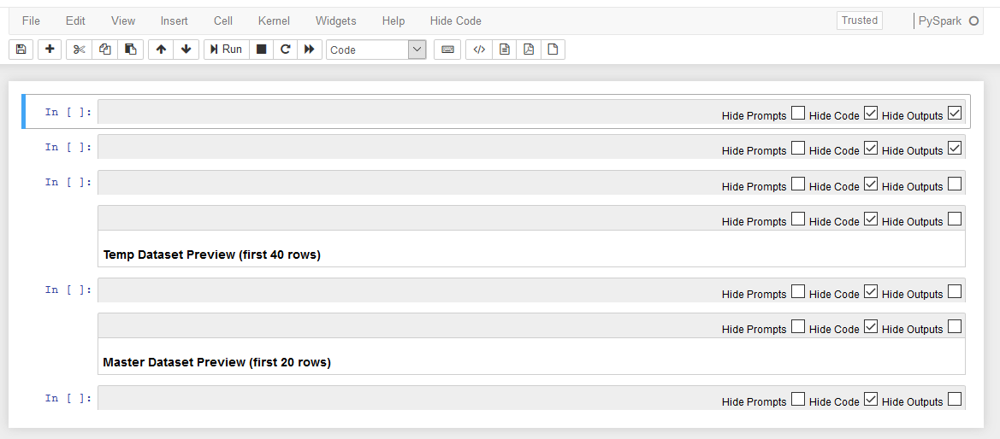

This is the initial state. All code cells are hidden and all output has been cleared. If you are not interested in reviewing or altering the code (it is not required in the standard workflow) you may proceed with hiding the cell toolbars.
In order to do that, select "View" from the menu, then "Cell Toolbar" and click on the "None" option, as shown below.

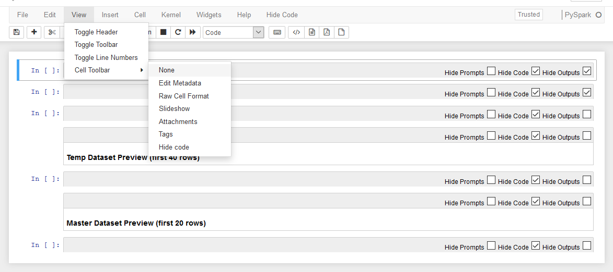 

You should now see the following screen

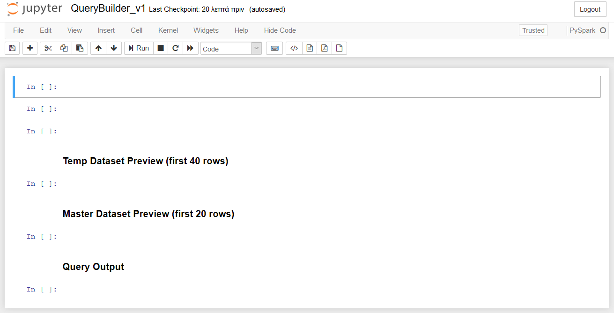

## STEP 3 - Initialize the notebook

Run the first cell: Make sure that the first cell is selected and either click on the "Run" button from the top Jupyter menu, or press ctrl+enter.
You should see a button appearing as shown below.

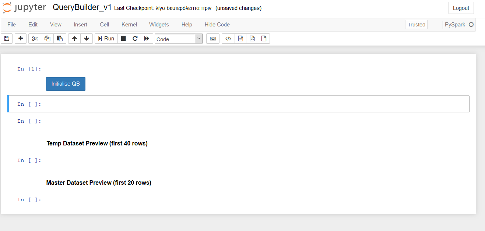

Click on the button and wait for the execution to stop. When this is donw, you should see a screen like the one below, where all cell prompts have been replaced by numbers and a simple UI with two buttons has appeared.

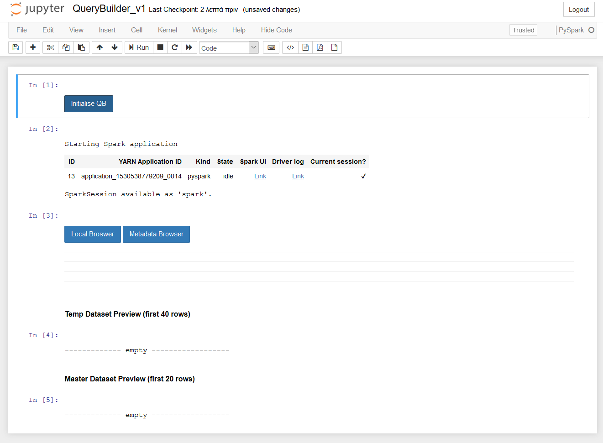

Note that the output regarding the Spark application will only appear when the interpreter is started. This means that if the "Initialise QB" button is pressed again, the message will disappear, but the tool will be still functional.

## STEP 4 - Working with the Query Builder

### Selecting a file

Query Builder offers two ways of exploring available files, each one corresponding to the two initial buttons.

The **Metadata Browser** button shows the available datasets according to information from the metadata repository. For each dataset, the title, description, contact point, publisher and relevant keywords are provided.  

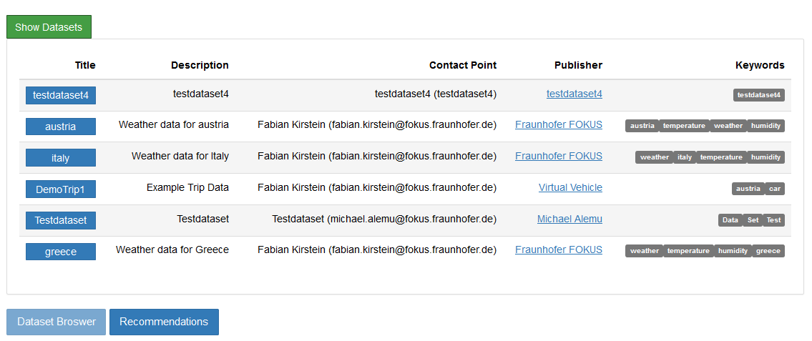

By selecting a dataset, its contents (individual files) are presented:

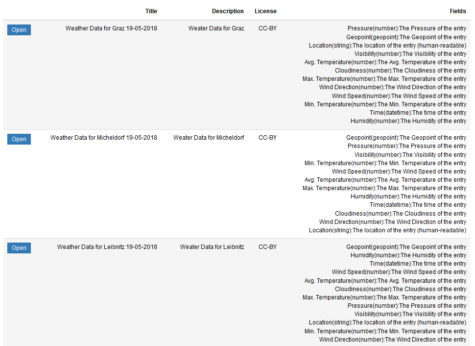

If you press the "open" button of a file, then the file is loaded (as a PySpark Dataframe) and becomes available for further processing/querying.

This data browsing is mostly intended for users exploring projects with a lot of data who are not yet certain which particular files they are interested in. If you already know which file you want to open, you should press the **Local Browser** button and select the file from the dropdown list that will appear (as shown below):

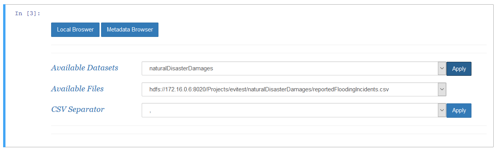

Once you choose a file and press the select button, the file will be loaded (as a PySpark Dataframe) and become available for further processing/querying.

Dataframes are essentially data tables. At each moment, Query Builder has two Dataframes: the **temporary dataframe(tempDF)** which holds the result of the last performed action, i.e. the contents of a file or the result of applying a filter/query on the previous contents of tempDF and the **master dataframe (MasterDF)** which is explicitly updated by pressing a button that moves the tempDF contents to the MasterDF.

### Manipulating the temporary Dataframe (tempDF)

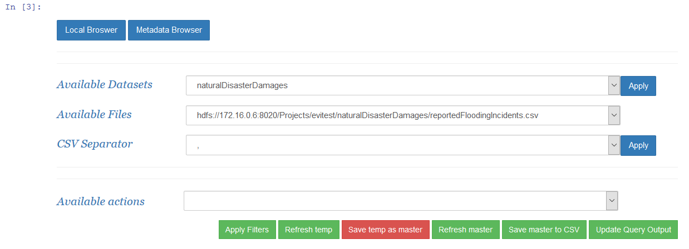

When a file is loaded, a form appears with several options for simple data filtering and processing.

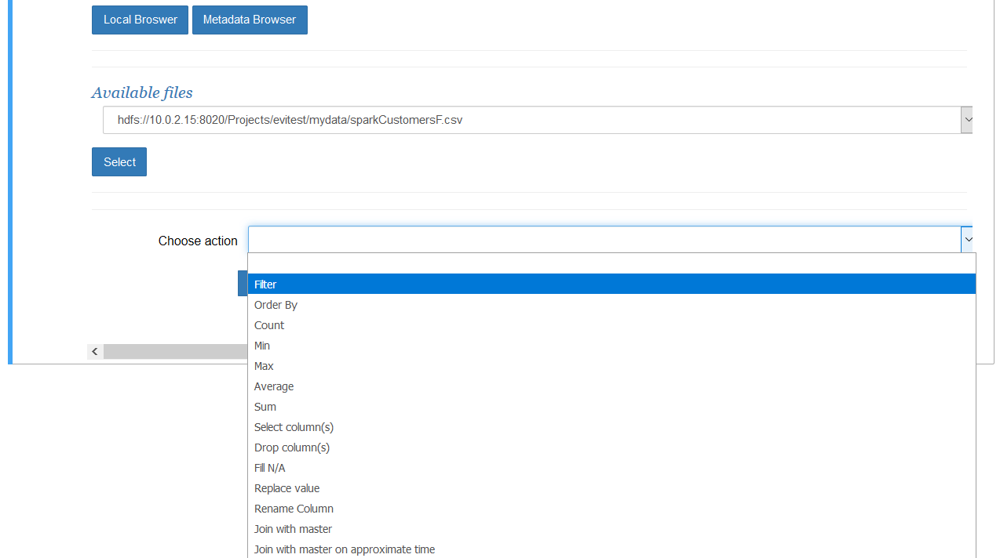

Each selected action will open a new form with the necessary parameters. Once you fill the required information and press OK a new filter will be added in the queue to be applied when you want. As an example, if you choose the "Rename Column" filter you will need to select which column to rename and which should be the new name.

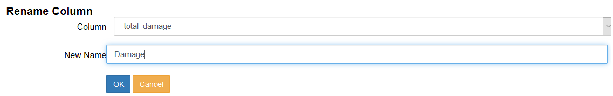

Once you press OK, the filter will be added in the queue, under the "Selected Filters" label

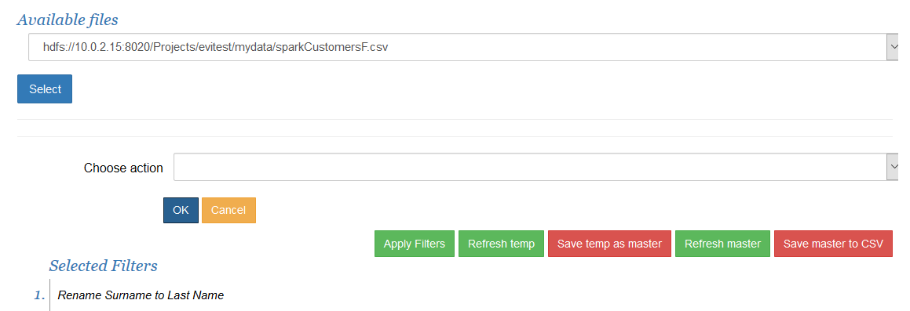

You may add more than one such filters before executing them. They will be added in the same list:

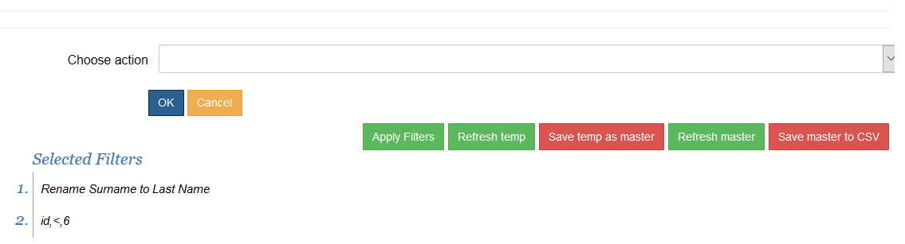

When you want to apply them, click on the "Apply Filters" button. When the execution is finished, all successfully applied filters will have changed colour:

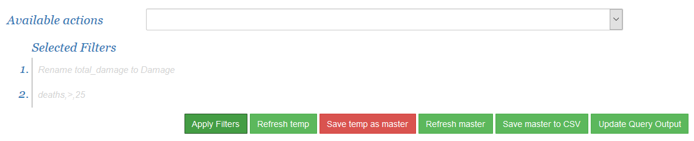

You may continue adding new filters after that point. The list will show both which filters have been already applied and which are pending:

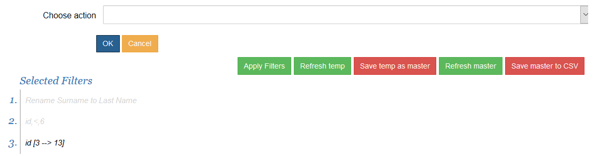

### Previewing the contents of a Dataframe

By pressing the "Refresh temp" button, you will get the first 40 lines of the tempDF.

This is useful both when you first load a file

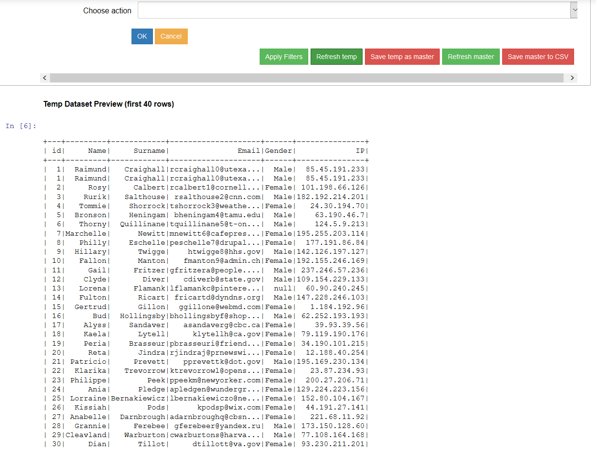

but also to review the result of applying some filters 

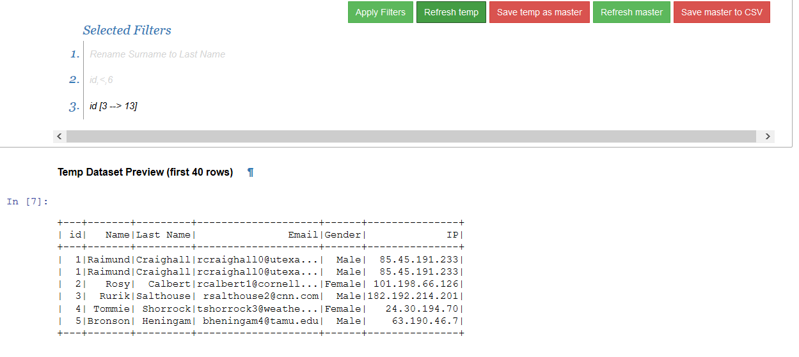

A "Refresh Master" button is also available to preview the contents of the master Dataset. Keep in mind that the two Dataframes may hold completely different data. You may also join the two Dataframes through the corresponding option in the filters form. The result will be kept in the tempDF.

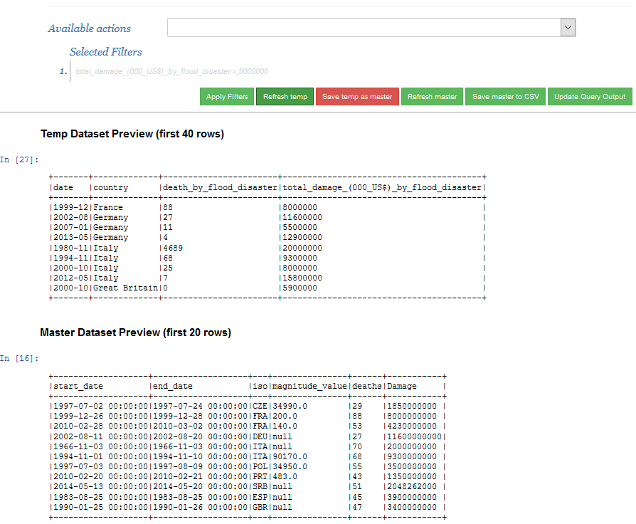

## STEP 5 - Cleaning up

You may load, process and combine data following the previous steps in any order, until you are satisfied with the end-result. At any time, you may press the "Initialise QB" button to clear the screen and start over.
When you have completed your work with the Query Builder, you may either directly exit the Notebook or clear all the output first so that you can have a fresh start without any leftovers the next time. This can be achieved from Jupyter's top menu. Choose **Cell -> All Output -> Clear**

# Important Notes
All the instructions above refer to the Query Builder as a standalone notebook and may be changed in future integrated versions.
